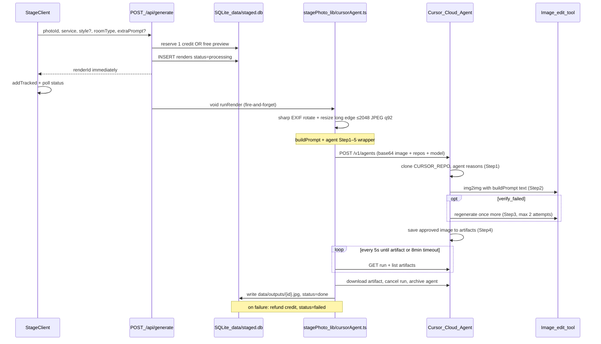

# Image generation pipeline — handoff

> For AI agents and humans picking up Stagely (`sid-081205/staged`).  
> Live site: https://stagely.org · App root: this repo · Default branch: `master`.

This document describes **how image generation works today**, what we already changed for **fidelity (hard constraints)**, what is still missing for **output dimensions**, and **how to speed things up without wrecking quality**.

---

## Product context

Stagely is a Next.js real-estate photo tool. Users upload room photos and pick one of:

| Service key | UI label | Effect |
| --- | --- | --- |
| `stage` | Stage with furniture | Add furniture (style + room type) |
| `declutter` | Remove furniture and clutter | Empty the room |
| `enhance` | Fix lighting and sky | Exposure / WB / sky only |

Credits: packs via Stripe; 1 free watermarked preview per account. Renders run in the background on a **persistent VPS** (not serverless).

---

## Critical misconception

**This is not a simple “Composer image API” call.**

Generation goes through the **Cursor Cloud Agents API** (`POST https://api.cursor.com/v1/agents`). That:

1. Boots a Cursor-managed VM  
2. Clones `CURSOR_REPO` (default `https://github.com/sid-081205/images`)  
3. Runs model `CURSOR_MODEL` (default `composer-2.5`) as a **coding agent**  
4. Agent is instructed to call an **image-to-image / edit tool** inside that sandbox  
5. We poll until an image appears in **artifacts**, download it, cancel/archive the agent  

Activity on the `images` GitHub repo during renders is **expected** (repo clone / agent workspace), not a separate product deploy.

There is **no direct Composer img2img REST** wired in this codebase today.

---

## End-to-end workflow (current)

### Step-by-step

1. **Upload** — `POST /api/jobs` stores originals under `data/uploads/`, rows in `photos`.
2. **Generate** — User on `/stage` → `POST /api/generate` ([`app/api/generate/route.ts`](app/api/generate/route.ts)).
3. **Credits** — Decrement `users.credits` or bump `users.free_used` (max `FREE_PREVIEWS` in config). Refunded if render fails (or photo deleted while still `processing`).
4. **Prompt** — `buildPrompt(service, style, roomType, extraPrompt)` in [`lib/config.ts`](lib/config.ts).
5. **Worker** — `stagePhoto(inputPath, prompt, tag)` in [`lib/cursorAgent.ts`](lib/cursorAgent.ts).
6. **Client UX** — [`lib/renderTracker.ts`](lib/renderTracker.ts) + [`components/RenderTracker.tsx`](components/RenderTracker.tsx) bottom-left popup (“Takes 2–3 minutes…”). Listing page also polls job state every 3s.
7. **Serve result** — `GET /api/image/[id]?kind=preview|full|original` (paid full-res vs watermarked free preview).

### Env vars (names only — never commit secrets)

| Variable | Purpose |
| --- | --- |
| `CURSOR_API_KEY` | Basic auth to `api.cursor.com` |
| `CURSOR_REPO` | GitHub repo cloned into each agent (default `sid-081205/images`) |
| `CURSOR_MODEL` | Agent model id (default `composer-2.5`) |
| `MOCK_GENERATION=1` | Skip Cursor; tinted sharp mock for local UI |

### Key constants ([`lib/cursorAgent.ts`](lib/cursorAgent.ts))

- Input: long edge capped at **2048**, `fit: "inside"`, JPEG quality **92** (`preprocessInput`, records target width×height)
- Poll interval: **3s**
- Timeout: **8 minutes** (safety net; typical renders now 2–3 min)
- Artifact pick: largest `.png` / `.jpg` / `.webp` with `sizeBytes > 10_000`
- Output normalize: `lockToDimensions` — cover-resize to the recorded input width×height, JPEG quality **95**

---

## Prompt stack (two layers)

### Layer A — Image-tool instruction: `buildPrompt`

Built in [`lib/config.ts`](lib/config.ts). This string is what the agent must pass to the image edit tool.

**Already in production (2026-07):** “hard negatives” / DO NOT framing (prompt-lab variant **C**), for `stage`, `declutter`, and `enhance`:

- Shared `HARD CONSTRAINTS`: do not change windows/frames/view, walls, floor, ceiling, trim, doors, radiators, vents, outlets, built-ins, camera/perspective/crop; do not rebuild architecture; do not replace the room.
- **Stage:** add furniture from `STYLES[style].prompt`; only new pixels = furniture/decor on existing floor.
- **Declutter:** remove movable clutter; reconstruct floor/walls where items sat.
- **Enhance:** photographic quality only; do not move objects.
- Optional user `extraPrompt` is appended; must not override architecture rules.
- Room type is dynamic (`kitchen`, `living room`, …) via `ROOM_TYPES`.

### Layer B — Agent wrapper (`buildAgentPrompt` in [`lib/cursorAgent.ts`](lib/cursorAgent.ts))

Around `buildPrompt`, the agent is told to (generate-first, 2026-07):

1. IMMEDIATELY call the image tool in img2img mode with the attached photo as reference + Layer A text — no written scene analysis first  
2. The wrapper injects the exact `OUTPUT DIMENSIONS` (width×height + orientation) of the preprocessed input  
3. **Verify** vs original with the same DO NOT checks; regenerate **exactly once** if a hard constraint drifted (`enhance` never regenerates)  
4. Save only the approved image to artifacts  
5. Reply DONE — no git commit / PR

### Experiments (not production)

[`experiments/prompt-lab/`](experiments/prompt-lab/) mirrors the same Cloud Agents path to A/B prompt wording. Galleries under `experiments/prompt-lab/output-*`. Do **not** import this folder from the app; promote winners into `buildPrompt` / wrapper only.

---

## Measured latency (same stack as prod)

From prompt-lab timings on real runs:

| Stage | Typical | Share |
| --- | --- | --- |
| Preprocess (sharp) | ~0.1s | negligible |
| Create agent API | ~3–6s | tiny |
| **Poll until artifact** (VM + think + image tool ± 2nd attempt) | **~5–6.5 min** | **~98%** |
| Download | ~1–2s | tiny |
| Post JPEG | ~0.1s | tiny |

**Wall clock per render: usually 5–7 minutes.** Almost all time is Cloud Agent sandbox + model/tool work, not our Node code.

---

## Output dimensions / aspect ratio

### Desired product behavior

1. **Accept every upload aspect ratio** — portrait, landscape, square; any reasonable phone/MLS size (within `MAX_UPLOAD_BYTES`). Do not reject or force landscape.
2. **Final delivered image must match the upload’s display dimensions / aspect ratio** — same orientation; same pixel size as the **preprocessed** input we send to the model (after EXIF rotate + long-edge cap), or an explicitly documented equivalent (e.g. exact `width×height` of that buffer).
3. **Never silently crop to landscape** or a fixed model default (e.g. 1536×1024) without correcting back.

### Current production state (2026-07, dimension lock SHIPPED)

- Upload path applies EXIF orientation via sharp when decoding/serving.
- Generation input is resized with `fit: "inside"` (aspect preserved **into** the model); `preprocessInput` in [`lib/cursorAgent.ts`](lib/cursorAgent.ts) records the resulting `width`×`height`.
- The agent wrapper (`buildAgentPrompt`) tells the model the exact target pixel size and orientation (`OUTPUT DIMENSIONS: … ${width}×${height} (portrait/landscape/square)`), and `buildPrompt` carries a matching hard constraint.
- After download, `lockToDimensions` cover-resizes the artifact to exactly the recorded input size — a portrait upload can never come back as a landscape crop. Mock mode goes through the same contract.

### FAQ (shipped)

The marketing page ([`app/page.tsx`](app/page.tsx) FAQ) now includes: how the supervised render process works, which photos work best (any orientation), and the same-dimensions promise.

---

## Speed improvements (without wrecking quality)

Ranked by impact vs risk. Hard-negatives in `buildPrompt` should stay unless a bake-off proves otherwise.

### A. Stay on Cloud Agents (smaller wins)

1. **[SHIPPED 2026-07] Generate-first wrapper** — the agent's first action is the image tool call; no written scene inventory. Verify is kept but capped at ONE regeneration, and `enhance` never regenerates. See `buildAgentPrompt` in [`lib/cursorAgent.ts`](lib/cursorAgent.ts) and `experiments/pipeline-v2/` for the bake-off.
2. **[SHIPPED 2026-07] Faster polling** — 3s interval (was 5s).
3. **Reduce repo overhead** — Investigate API options for no-repo / empty snapshot; cloning `images` every time is pure overhead for img2img.
4. **Model / fast params** — If Cloud Agents supports `params` like `fast`, A/B in prompt-lab (`experiments/model-comparison`, `experiments/prompt-lab`).

### B. Biggest win: direct image API

6. **Replace `stagePhoto` internals** with a real img2img provider (Fal, Replicate, Flux Kontext, Ideogram, Gemini image edit, OpenAI Images, etc.).
   - Keep: `buildPrompt`, credits, DB, UI, background `runRender`.
   - Swap: only [`lib/cursorAgent.ts`](lib/cursorAgent.ts) (or introduce `lib/imageProviders/*` with a thin interface).
   - Target: **tens of seconds**, not 5–7 minutes.
   - Validate fidelity with prompt-lab fixtures (kitchen + living room + portrait) before cutting over.

7. **Hybrid** — Fast provider by default; escalate to Cloud Agent only on quality failure (more complexity).

### C. Quality-preserving extras

8. Dimension lock post-process (see above) — doesn’t speed gen; avoids retry-for-aspect.
9. Lower long-edge for free previews only (e.g. 1280 vs 2048 paid).

---

## Suggested implementation order for the next agent

1. ~~**Dimension lock in `stagePhoto`** + FAQ entry on [`app/page.tsx`](app/page.tsx)~~ — DONE (2026-07).  
2. ~~**One-shot agent wrapper** A/B~~ — DONE (2026-07), gated verify with max 1 regeneration; bake-off in `experiments/pipeline-v2/`.  
3. **Provider interface + one direct img2img backend** (structural speed fix, only if 2–3 min is still too slow).  
4. Deploy: `master` → VPS `/home/staged/app` → `git pull && npm ci && npm run build && systemctl restart staged`.

---

## Related paths

| Path | Notes |
| --- | --- |
| [`lib/cursorAgent.ts`](lib/cursorAgent.ts) | Cloud Agents worker |
| [`lib/config.ts`](lib/config.ts) | `buildPrompt`, styles, services, rooms |
| [`app/api/generate/route.ts`](app/api/generate/route.ts) | Credits + fire-and-forget |
| [`app/api/photos/[id]/route.ts`](app/api/photos/[id]/route.ts) | Delete photo + renders (+ refund in-flight) |
| [`app/page.tsx`](app/page.tsx) | Marketing + FAQ (add dimensions FAQ here) |
| [`experiments/prompt-lab/`](experiments/prompt-lab/) | Prompt / timing / aspect experiments |
| VPS | `root@157.90.167.166`, app user `staged`, systemd `staged.service` |

---

## Do not

- Commit `.env` or API keys  
- Import `experiments/` from the Next app  
- Claim same-output-dimensions in marketing/FAQ before the lock is in `stagePhoto`  
- Assume “Composer” means a one-shot image HTTP API in this repo — it does not today  
